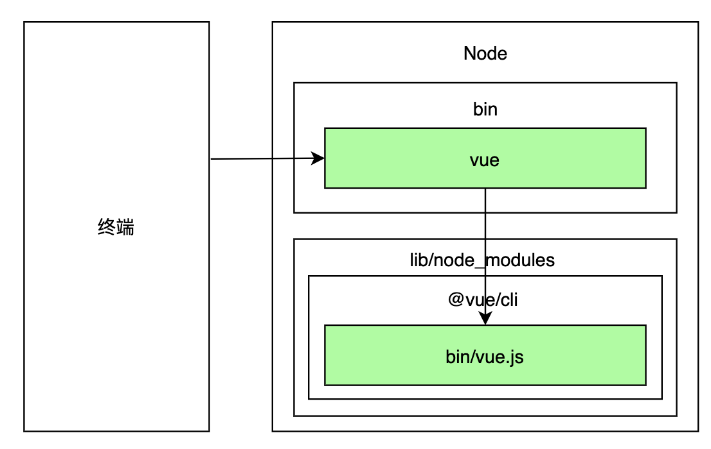
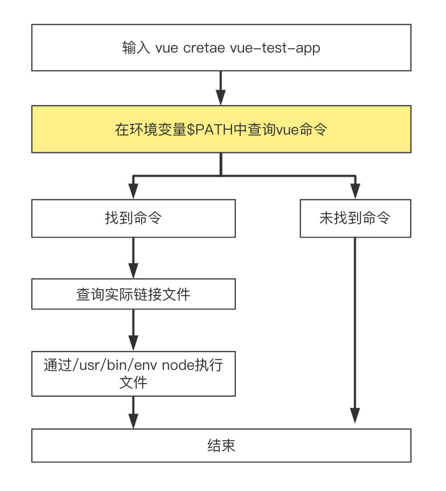

# 脚手架介绍

#### 脚手架本质是一个操作系统的客户端，他通过命令执行

```shell
vue create vue-app
```

主要由3个命令组成：

* 主命令:`vue`
* command:`create`
* command的参数param: `vue-app`

表示创建一个vue项目，项目名称为vue-app，这是一个较为简单的脚手架命令，实际场景往往更加复杂

如果当前目录已经有文件了，我们需要覆盖当前目录下的文件，强制进行安装vue项目，可以使用`--force`参数

```shell
vue create vue-app --force
```

这里的`--force`叫做`option`,用来辅助脚手架确认在特定场景下用户的选择(可以理解为配置)，例如场景:

通过`vue create`创建项目时，会自动执行`npm install`帮用户安装依赖，假设我们希望使用淘宝源安装:

```shell
vue create vue-app --force --register https://registry.npm.taobao.org
```

输入如下命令就可以看到`vue create`所支持的所有options:

```shell
vue create -help
```

#### 脚手架执行原理

在终端输入`vue create vue-app`,终端首先解析出`vue`，然后在node环境变量中找到`vue`命令，此时这个`vue`指向的是一个软连接(`./lib/node_modules/@vue/cli/bin/vue.js`)

因为它是一个软连接，实际执行的是软连接指向的地址

终端根据vue命令链接到实际文件`vue.js`，然后利用node执行`vue.js`，`vue.js`解析command/options并且执行command，执行完成之后最后退出

<div style="text-align: left;width:600px">
  
</div>


:::warning 注意
`./lib/node_modules`这个包下面 我们把它称之为全局依赖,通过npm安装的包都会进入这个依赖包下
:::

#### 为什么全局安装`@vue/cli`后会添加的命令为`vue`?
* 首先全局安装成功之后，进入`node/bin`目录下会存在多个软连接文件,其中`vue`软连接指向的是`/lib/node_modules/@vue/cli/bin/vue.js`

* 我们根据该地址找到该对应文件(`./lib/node_modules/@vue/cli/bin`)目录，此时可以看到目录下会有一个`package.json`文件，里面的`bin`配置的对象名称就是生成软连接的名称以及软连接地址
```json
{
  "bin": {
    "vue": "bin/vue.js"
  }
}
```

#### 全局安装 `@vue/cli` 发生了什么?
* 首先将包安装到`node_modules`下
* 然后解析`package.json`文件中的`bin`配置，如果找到该配置那么就会在node主目录下创建一个软连接，软连接指向的就是配置的bin指向实际链接

#### 执行vue命令时发生了什么？ 为什么vue指向一个js文件，我们确可以直接通过vue命令去直接执行它？
* 我们操作系统在环境变量中去找到这个`vue`命令，完后会根据软链接指向地址找到这个执行文件
* `/lib/node_modules/@vue/cli/bin/vue.js` 第一行有申明命令 `#!/usr/bin/env node` ;进入该文件首先声明了`#!/usr/bin/env node` 表示会去环境变量中查找`node`命令,用node去执行这个文件

:::tip 创建一个自定义命令，去执行文件
实现思路：在环境变量中创建一个软连接，指向执行文件即可

进入到node的bin目录下(`/.nvm/versions/node/v15.0.0/bin`)然后创建软连接

执行命令： `ln -s /Users/**/Desktop/test-pro/test.js myapp`

这个时候可以看到目录下会多出一个命令
```shell
lrwxr-xr-x  1 **  staff  39  9 19 16:10 myapp -> /Users/**/Desktop/test-pro/test.js
```

```js
// Desktop/test-pro/test.js
#!/usr/bin/env node
console.log('hello world')
```
执行myapp命令，会输出文件的console

注：如果出现`permission denied`文件权限，可以执行`chmod 777 test.js` 再次运行myapp

删除软链接`rm -rf myapp`
:::

#### 脚手架命令执行全过程
<div style="text-align: left;width:500px">
  
</div>


#### 本地调试流程
```shell
# 链接本地脚手架
cd you-cli-dir
npm link

# 链接本地库文件
cd you-lib-dir
npm link
cd you-cli-dir
npm link you-lib

# 取消链接本地库文件
cd you-lib-dir
npm unlink
cd you-cli-dir

# 如果link 存在
npm unlink you-lib
# 如果link 不存在
rm -rf node_modules

npm install
```

